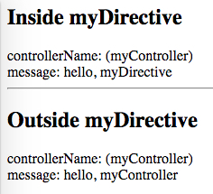

AngularJS1 Directive `scope: { myAttr: '&outAttr' }` Demo
=========================================================

```
scope: { localFn: '&outFn' }
```

用来让parent向内部的directive暴露一些回调函数。

注意：

- 在看代码时注意函数名之间的对应关系，不要乱了
- 在directive调用回调函数时，传的参数是JSON形式


```
npm install
open index.html
```



Resources
---------

- AngularJS1: <https://angularjs.org/>
- directive scope api: <https://docs.angularjs.org/api/ng/service/$compile#-scope->
- scope `&` sample: <https://docs.angularjs.org/guide/directive#creating-a-directive-that-wraps-other-elements>
- $element api: <https://docs.angularjs.org/api/ng/function/angular.element#angularjs-s-jqlite>