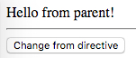

AngularJS1 Directive `scope: { myAttr: '&outAttr' }` Demo
=========================================================

```
scope: { localFn: '&outFn' }
```

用来让parent向内部的directive暴露一些回调函数。

注意，如果外面传的参数是：

```
updateMessage(newMessage)
```

那么在directive中，应该这样调用：

```
updateMessage({
    newMessage: 'some message'
})
```

```
npm install
open index.html
```



Resources
---------

- AngularJS1: <https://angularjs.org/>
- directive scope api: <https://docs.angularjs.org/api/ng/service/$compile#-scope->
- scope `&` sample: <https://docs.angularjs.org/guide/directive#creating-a-directive-that-wraps-other-elements>
- $element api: <https://docs.angularjs.org/api/ng/function/angular.element#angularjs-s-jqlite>